<!-- Palette: void #0A0F1F, signal cyan #22D3EE, synapse violet #A78BFA, pass green #34D399.
     Every card in ./profile is generated by .github/workflows/profile-refresh.yml -->

<p align="center">
  
</p>

<p align="center">
  
</p>

<p align="center">
  <a href="https://aayushmishra.engineer/"></a>
  <a href="https://www.linkedin.com/in/aayushmishra33/"></a>
  <a href="mailto:Aayushmishra026@gmail.com"></a>
  <br/>
  <a href="https://medium.com/@aayushmishra.tech"></a>
  <a href="https://x.com/Aayush_Mishraa"></a>
  <a href="https://orcid.org/0009-0003-4404-5278"></a>
</p>

<p align="center">
  <b>Open to Senior SDET, QA Automation Lead and AI Quality Engineering roles.</b><br/>
  <sub>Gurugram · Bangalore · Hyderabad · remote-friendly</sub>
</p>

<br/>

## `$ cat aayush.spec.yml`

```yaml
role:        Senior SDET & Automation Architect @ Keywords Studios
experience:  4+ years, leading QA across multiple products at once
domains:     [gaming, banking, healthcare, e-commerce, logistics]
education:   MSc Data Science, BSc Computer Science

what_i_do:
  - architect test automation frameworks for web, API and mobile
  - wire quality gates into CI/CD so regressions never reach main
  - test LLM apps, RAG pipelines and AI agents like any other critical system
  - run QA as a lead: test strategy, plans, reporting and release sign-off

building_now:
  - one framework that runs UI, API and mobile suites from a single pipeline
  - a microservices test automation framework
  - LLM evaluation suites that fail the build when answers drift

ask_me_about: [Playwright, Selenium, RestAssured, Postman/Newman, DeepEval, Playwright MCP]
```

<br/>

## 🧪 Featured work

<p align="center">
  <a href="https://github.com/Aayush-Mishraa/AI-Agent-Test-Using-Amazon-Nova-Act"></a>
  <a href="https://github.com/Aayush-Mishraa/FullStack-E-Commerce-Testing"></a>
  <a href="https://github.com/Aayush-Mishraa/API-Automation-Framework-Playwright"></a>
  <a href="https://github.com/Aayush-Mishraa/Playwright-With-Cucumber-Using-JS"></a>
  <a href="https://github.com/Aayush-Mishraa/AutoCart-Engine-FW-"></a>
  <a href="https://github.com/Aayush-Mishraa/Phoenix-Inwarranty-Flow-API-Tests-"></a>
</p>

<br/>

## 🧠 AI quality engineering

AI features don't fail like normal code. The same prompt can pass today and hallucinate tomorrow, so I treat model output, retrieval quality and agent behaviour as things to measure and gate, not eyeball. My [Amazon Nova Act agent framework](https://github.com/Aayush-Mishraa/AI-Agent-Test-Using-Amazon-Nova-Act) runs end-to-end UI scenarios written in plain English.

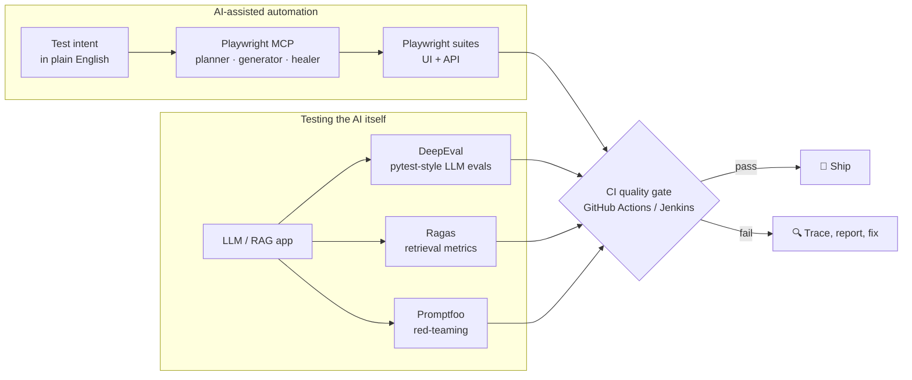

| Layer | Tools | What it checks |
|:--|:--|:--|
| **Agentic UI testing** | Playwright MCP, Playwright Test Agents, Amazon Nova Act, Browser-Use | Agents explore the live app, draft test plans, generate specs and repair broken locators |
| **LLM output evals** | DeepEval (G-Eval, hallucination, answer relevancy) | Pytest-style assertions on model responses, with pass/fail thresholds in CI |
| **RAG evaluation** | Ragas | Faithfulness, context precision and context recall, so you know whether retrieval or generation is the weak link |
| **Red-teaming & prompt regression** | Promptfoo | Prompt injection, jailbreaks and PII leaks, plus side-by-side comparison of prompt versions |
| **MCP servers & agents** | MCP Inspector, tool-call assertions | Tool schemas, tool-call accuracy and whether the agent actually reached its goal |
| **Observability** | Langfuse, Arize Phoenix | Production traces that feed real failures back into the eval dataset |

<p align="center">
  
  
  
  
  
  
  
  
  
</p>

<br/>

## 🛡️ Testing across the stack

| Area | What I cover | Tools |
|:--|:--|:--|
| **UI & end-to-end** | Page Object Model, cross-browser runs, parallel execution, retries, screenshots and traces on failure | Playwright, Selenium |
| **API & microservices** | Schema validation, auth flows, chained requests, data-driven suites, environment configs | RestAssured, Playwright API, Postman + Newman |
| **Mobile** | Native and hybrid app flows | Appium |
| **BDD** | Business-readable scenarios that product owners can review | Cucumber, TestNG |
| **Performance** | Load and stress tests with pass/fail thresholds | JMeter, k6 |
| **Security** | OWASP Top 10 checks, HTTP security-header audits, reproducible bug reports | Browser DevTools, Postman |
| **CI/CD & infra** | Pipelines that gate merges, containerised test runs, cloud test infrastructure | GitHub Actions, Jenkins, Docker, AWS, Azure |
| **Reporting & management** | Allure dashboards, traceable test cases, plans and release reports | Allure, JIRA, Zephyr, TestRail |
| **Process** | Shift-left testing, IEEE 829-style test plans, QA leadership across parallel products | |

<p align="center">
  
  
  
  
  
  
  
  
  
  
  
  
</p>

<p align="center">
  <br/>
  <br/>
  
</p>

<br/>

## 📊 Signal

<p align="center">
  
  
</p>

<p align="center">
  
</p>

<p align="center">
  
</p>

<p align="center">
  <picture>
    <source media="(prefers-color-scheme: dark)" srcset="./profile/snake-dark.svg" />
    <source media="(prefers-color-scheme: light)" srcset="./profile/snake.svg" />
    
  </picture>
</p>

<br/>

<p align="center">
  Happy to talk test architecture, AI evaluation and quality engineering.<br/>
  The fastest way to reach me is <a href="mailto:Aayushmishra026@gmail.com">email</a> or <a href="https://www.linkedin.com/in/aayushmishra33/">LinkedIn</a>.
</p>

<p align="center">
  
</p>


