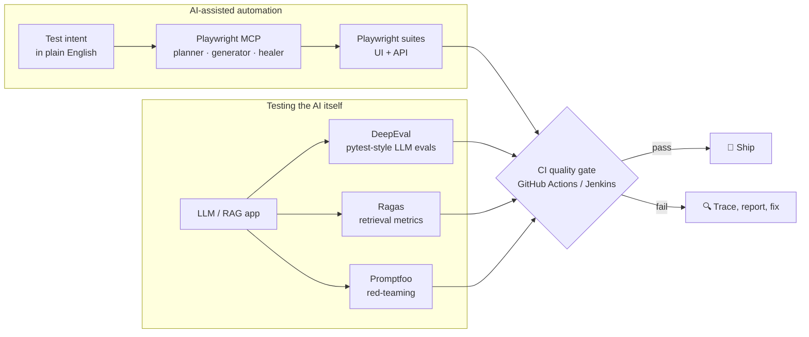

<!-- ======================================================================
     Aayush Mishra · GitHub profile
     Palette: void #0A0F1F · signal cyan #22D3EE · synapse violet #A78BFA · pass green #34D399
     ====================================================================== -->

<p align="center">
  
</p>

<p align="center">
  
</p>

<p align="center">
  <a href="https://aayushmishra.tech/"></a>
  <a href="https://linkedin.com/in/aayush-mishra072/"></a>
  <a href="mailto:Aayushmishra026@gmail.com"></a>
  <a href="https://twitter.com/Aayush_Mishraa"></a>
</p>

<br/>

## `$ cat aayush.spec.yml`

```yaml
role:        Senior SDET & Automation Architect @ Keywords Studio
based_in:    Gurugram, India
experience:  4+ years across gaming, banking, healthcare, e-commerce and logistics
education:   MSc Data Science, BSc Computer Science

what_i_do:
  - design test automation frameworks for web, API and mobile
  - wire quality gates into CI/CD so regressions never reach main
  - test LLM apps, RAG pipelines and AI agents like any other critical system

building_now:
  - one framework that runs UI, API and mobile suites from a single pipeline
  - a microservices test automation framework
  - LLM evaluation suites that fail the build when answers drift

ask_me_about: [Playwright, Selenium, RestAssured, Postman/Newman, DeepEval, Playwright MCP]
```

<br/>

## 🧠 AI quality engineering

AI features don't fail like normal code. The same prompt can pass today and hallucinate tomorrow, so I treat model output, retrieval quality and agent behaviour as things to measure and gate, not eyeball.



| Layer | Tools | What it checks |
|:--|:--|:--|
| **Agentic UI testing** | Playwright MCP, Playwright Test Agents, Browser-Use, Amazon Nova Act | Agents explore the live app through the accessibility tree, draft test plans, generate specs and repair broken locators |
| **LLM output evals** | DeepEval (G-Eval, hallucination, answer relevancy) | Pytest-style assertions on model responses, with pass/fail thresholds that run in CI |
| **RAG evaluation** | Ragas | Faithfulness, context precision and context recall, so you know whether retrieval or generation is the weak link |
| **Red-teaming & prompt regression** | Promptfoo | Prompt injection, jailbreaks and PII leaks, plus side-by-side comparison of prompt versions |
| **MCP servers & agents** | MCP Inspector, tool-call assertions | Tool schemas, tool-call accuracy and whether the agent actually reached its goal |
| **Observability** | Langfuse, Arize Phoenix | Production traces that feed real failures back into the eval dataset |

<p align="center">
  
  
  
  
  
  
  
  
  
</p>

<br/>

## ⚙️ Core automation stack

<p align="center">
  
  
  
  
  
  
  
</p>

<p align="center">
  <br/>
  <br/>
  
</p>

<br/>

## 📊 Signal

<p align="center">
  
  
</p>

<p align="center">
  
</p>

<p align="center">
  
</p>

<p align="center">
  <picture>
    <source media="(prefers-color-scheme: dark)" srcset="https://raw.githubusercontent.com/Aayush-Mishraa/Aayush-Mishraa/output/github-snake-dark.svg" />
    <source media="(prefers-color-scheme: light)" srcset="https://raw.githubusercontent.com/Aayush-Mishraa/Aayush-Mishraa/output/github-snake.svg" />
    
  </picture>
</p>

<br/>

<p align="center">
  Open to conversations about test architecture, AI evaluation and quality engineering.<br/>
  Everything I've built lives at <a href="https://aayushmishra.tech/">aayushmishra.tech</a>.
</p>

<p align="center">
  
</p>


